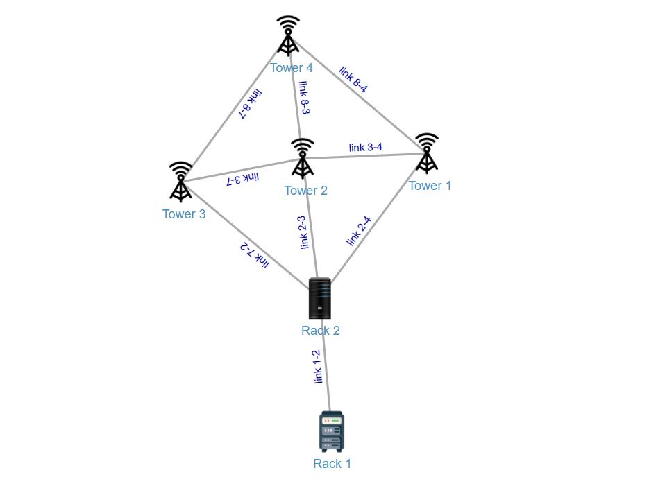

## d3 network Graph

Nice & smooth network graph using d3.js v7.6.1 in plain javascript, please modify/update as per your requirement. This is just one of the way to do it, lot of improvements can be done, this is just a crude effort to showcase the power of d3.js

### Features
- Image nodes
- Labels for nodes
- Labeled Links between nodes
- Drag functionality
- Tooltip functionality

### Output
